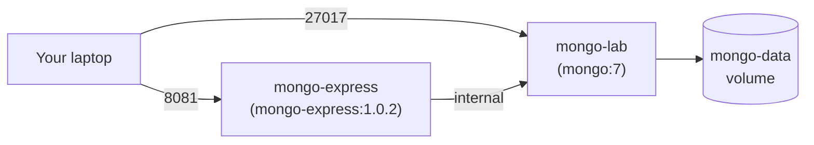

# Lab Setup

Start the Docker stack, confirm both containers are healthy, and connect to
MongoDB through `mongosh` and `mongo-express`. This is Lab Guide Part 1
(Module 1 — Lab Setup Check).

## The Stack

The lab runs two containers on a private Docker network:



Both containers and the `mongo-data` volume are defined in
[`docker-compose.yml`](../../docker-compose.yml).

## Start the Stack

From the lab root:

```bash
docker compose up -d
```

Confirm both containers are running:

```bash
docker compose ps
```

Expected output:

```text
NAME             STATUS              PORTS
mongo-lab        Up (healthy)        0.0.0.0:27017->27017/tcp
mongo-express    Up                  0.0.0.0:8081->8081/tcp
```

## Connect with mongosh

`mongosh` is bundled inside the `mongo:7` image, so you don't need to install
it locally:

```bash
docker exec -it mongo-lab mongosh -u admin -p 'ChangeMe123!'
```

You should land at a `>` prompt. Verify the version and list databases:

```javascript
db.version()
// '7.0.x'

show dbs
// admin    40.00 KiB
// config   12.00 KiB
// local    72.00 KiB
```

Exit the shell at any time with `.exit` or `Ctrl+D`.

## Connect with mongo-express

Open <http://localhost:8081> in your browser. Login when prompted:

| Field | Value |
|-------|-------|
| Username | `admin` |
| Password | `ChangeMe123!` |

You'll see the MongoDB databases listed. Use this UI when you want to browse
data visually — but the exercises are designed for `mongosh`.

## Stopping the Stack

| Command | Effect |
|---------|--------|
| `docker compose stop` | Stop containers, keep data |
| `docker compose down` | Remove containers, keep data volumes |
| `docker compose down -v` | Remove containers **and** delete all data |

> **Warning**: `docker compose down -v` wipes the `library` database and any
> exercise work. Only use it to start fresh.

## Troubleshooting

| Symptom | Likely Cause | Fix |
|---------|--------------|-----|
| Docker Desktop won't start at all | Hardware virtualization disabled in BIOS | See [Troubleshooting](04-troubleshooting.md) — Layer 1 |
| `WSL 2 installation is incomplete` (Windows) | Windows features not enabled | See [Troubleshooting](04-troubleshooting.md) — Layer 2 |
| `Bind for 0.0.0.0:27017 failed: port is already allocated` | Another MongoDB is running | `lsof -i :27017` then stop the process |
| `mongo-express` keeps restarting | `mongo-lab` isn't healthy yet | Wait 10s and refresh; check `docker logs mongo-lab` |
| `Authentication failed` in mongosh | Wrong username/password or typed `ChangeMe123` without `!` | Re-check the command; the `!` is part of the password |
| Slow `docker compose up` first time | Image pull on slow network | Run it before the session, not during it |

For deeper diagnosis (especially the virtualization stack), see the
[full Troubleshooting guide](04-troubleshooting.md).

## Next Steps

- [Loading Sample Data](03-loading-sample-data.md) — import the JSON files for Module 2
